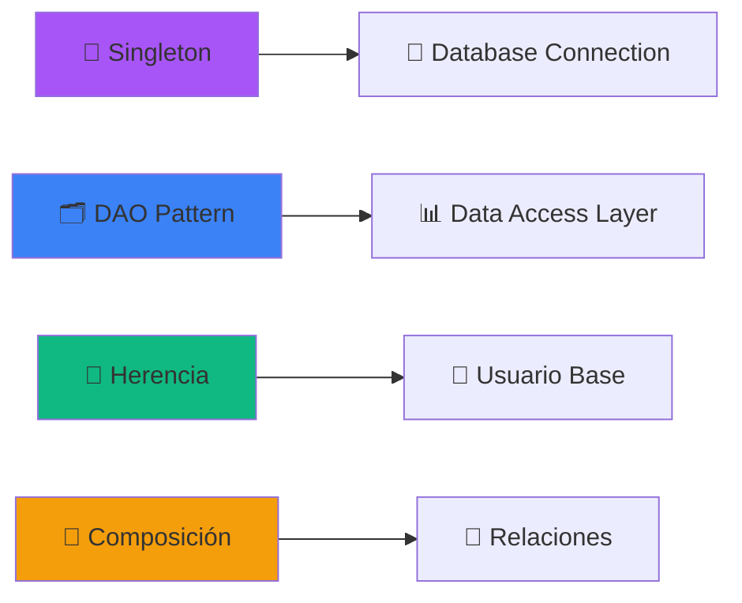
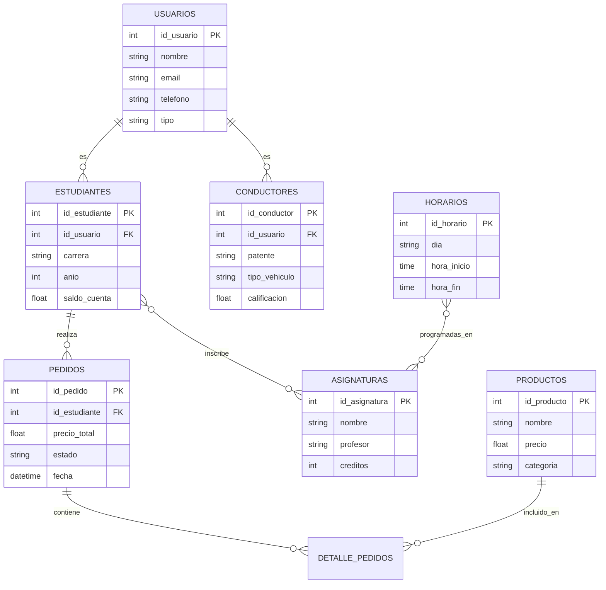

<div align="center">

# 🎓 Sistema de Gestión Universitaria
### POO Python + XAMPP + MySQL


[](https://www.python.org/)
[](https://www.mysql.com/)
[](https://www.apachefriends.org/)
[](LICENSE)


</div>

---

## 🌟 Características Principales

<table>
<tr>
<td width="50%">

### 👥 Gestión de Usuarios
```python
class Usuario:
    """Clase base abstracta"""
    🔐 Sistema de autenticación
    👤 Perfiles personalizados
    📊 Información completa
```

### 🎓 Módulo Estudiantes
```python
✅ Gestión académica completa
💰 Billetera virtual
📚 Inscripción de asignaturas
💳 Pago de servicios
📈 Historial académico
```

</td>
<td width="50%">

### 🚗 Módulo Conductores
```python
🚘 Registro de vehículos
⭐ Sistema de calificación
💵 Cálculo automático de tarifas
🗺️ Historial de viajes
📍 Registro de rutas
```

### 🛒 Sistema de Pedidos
```python
🛍️ Carrito de compras
📦 Catálogo de productos
✔️ Estados de pedido
💰 Cálculo de totales
📜 Historial de compras
```

</td>
</tr>
</table>

---

<div align="center">

## 🏗️ Arquitectura del Sistema


</div>

### 🎯 Patrones de Diseño Implementados



<div align="center">

### 📊 Diagrama de Clases UML

</div>


---

<div align="center">

## 🚀 Instalación y Configuración


</div>

### 📋 Requisitos Previos

| Tecnología | Versión | Descripción |
|------------|---------|-------------|
|  | 3.8+ | Lenguaje principal |
|  | 8.0+ | Base de datos |
|  | Latest | Servidor local |

### 🔧 Paso 1: Clonar el Repositorio

```bash
# Clonar el proyecto
git clone https://github.com/Arkanabytes/ProyectoPOOPhytonXAMPP.git

# Navegar al directorio
cd ProyectoPOOPhytonXAMPP

# Cambiar a la rama Pseint
git checkout Pseint
```

### 🔧 Paso 2: Configurar XAMPP

```bash
# 1. Descargar XAMPP desde: https://www.apachefriends.org/
# 2. Instalar XAMPP
# 3. Abrir el Panel de Control de XAMPP
# 4. Iniciar Apache y MySQL
```

<div align="center">


</div>

### 🔧 Paso 3: Crear la Base de Datos

```sql
-- Acceder a phpMyAdmin: http://localhost/phpmyadmin

CREATE DATABASE sistema_universitario;
USE sistema_universitario;

-- Las tablas se crearán automáticamente 🎯
```

### 🔧 Paso 4: Instalar Dependencias Python

```bash
# Instalar mysql-connector-python
pip install mysql-connector-python

# O usar requirements.txt
pip install -r requirements.txt
```

### 🔧 Paso 5: Configurar Conexión

```python
# Editar archivo de configuración
DB_CONFIG = {
    'host': 'localhost',
    'user': 'root',
    'password': '',  # Vacío por defecto en XAMPP
    'database': 'sistema_universitario'
}
```

---

<div align="center">

## 📁 Estructura del Proyecto

</div>

```
📦 ProyectoPOOPhytonXAMPP/
┣ 📂 models/
┃ ┣ 📜 usuario.py          # 👤 Clase abstracta Usuario
┃ ┣ 📜 estudiante.py       # 🎓 Clase Estudiante
┃ ┣ 📜 conductor.py        # 🚗 Clase Conductor
┃ ┣ 📜 producto.py         # 📦 Clase Producto
┃ ┣ 📜 pedido.py          # 🛒 Clase Pedido
┃ ┣ 📜 asignatura.py      # 📚 Clase Asignatura
┃ ┗ 📜 horario.py         # ⏰ Clase Horario
┣ 📂 dao/
┃ ┣ 📜 database_connection.py  # 💾 Singleton de conexión
┃ ┣ 📜 estudiante_dao.py       # 🗄️ DAO Estudiante
┃ ┣ 📜 pedido_dao.py          # 🗄️ DAO Pedido
┃ ┗ 📜 asignatura_dao.py      # 🗄️ DAO Asignatura
┣ 📂 sql/
┃ ┗ 📜 schema.sql         # 🗃️ Script de creación
┣ 📜 main.py              # 🚀 Punto de entrada
┣ 📜 config.py            # ⚙️ Configuración
┣ 📜 requirements.txt     # 📦 Dependencias
┗ 📜 README.md           # 📖 Este archivo
```

---

<div align="center">

## 💻 Ejemplos de Uso


</div>

### 🎓 Crear un Estudiante

```python
from models.estudiante import Estudiante
from dao.estudiante_dao import EstudianteDAO

# ✨ Crear instancia de estudiante
estudiante = Estudiante(
    id_usuario=1,
    nombre="Juan Pérez",
    email="juan.perez@universidad.cl",
    telefono="+56912345678",
    carrera="Ingeniería Civil Informática",
    anio=3
)

# 💾 Guardar en la base de datos
dao = EstudianteDAO()
dao.insertar(estudiante)

# 💰 Agregar saldo a la cuenta
estudiante.agregar_saldo(50000)
print(f"💵 Saldo actual: ${estudiante.saldo_cuenta}")

# 📚 Inscribir asignatura
from models.asignatura import Asignatura
asignatura = Asignatura(1, "Programación Orientada a Objetos", "Dr. Smith", 8)
estudiante.inscribir_asignatura(asignatura)
print("✅ Asignatura inscrita exitosamente")
```

### 🛒 Crear un Pedido

```python
from models.pedido import Pedido
from models.producto import Producto

# 🆕 Crear nuevo pedido
pedido = Pedido(id_pedido=1, id_estudiante=1)

# 📦 Agregar productos al carrito
producto1 = Producto("Laptop", 500000, "Electrónica")
producto2 = Producto("Mouse", 15000, "Accesorios")
producto3 = Producto("Teclado", 35000, "Accesorios")

pedido.agregar_producto(producto1, 1)
pedido.agregar_producto(producto2, 2)
pedido.agregar_producto(producto3, 1)

# ✅ Confirmar pedido
pedido.confirmar()
print(f"🎉 Pedido confirmado - Total: ${pedido.precio_total}")

# 📊 Mostrar detalle
pedido.mostrar_detalle()
```

### 🚗 Calcular Tarifa de Conductor

```python
from models.conductor import Conductor

# 🚘 Crear conductor
conductor = Conductor(
    id_usuario=2,
    nombre="María González",
    email="maria.gonzalez@email.com",
    telefono="+56987654321",
    patente="ABCD12",
    tipo_vehiculo="Sedan"
)

# 💵 Calcular tarifa del viaje
tarifa = conductor.calcular_tarifa(
    distancia=10.5,  # 📏 kilómetros
    tiempo=25,       # ⏱️ minutos
    pasajeros=3      # 👥 número de pasajeros
)

print(f"💰 Tarifa calculada: ${tarifa:,.0f}")

# 📝 Registrar el viaje
conductor.registrar_viaje(
    origen="Campus Universidad",
    destino="Metro Baquedano",
    distancia=10.5,
    tiempo=25,
    pasajeros=3
)
print("✅ Viaje registrado exitosamente")
```

### 📚 Gestionar Horarios

```python
from models.horario import Horario
from models.asignatura import Asignatura
from datetime import time

# ⏰ Crear horario
horario = Horario(
    id_horario=1,
    dia="Lunes",
    hora_inicio=time(8, 30),
    hora_fin=time(10, 0)
)

# 📖 Agregar asignaturas
asignatura1 = Asignatura(1, "POO", "Dr. Smith", 8)
horario.agregar_asignatura(asignatura1)

# 🔍 Verificar choques de horario
horario2 = Horario(2, "Lunes", time(9, 0), time(10, 30))
if horario.verificar_choque(horario2):
    print("⚠️ Conflicto de horario detectado!")
else:
    print("✅ Sin conflictos de horario")
```

---

<div align="center">

## 🗄️ Base de Datos


</div>

### 📊 Diagrama Entidad-Relación



### 📋 Tablas Principales

<table>
<tr>
<td>

#### 👥 USUARIOS
```sql
id_usuario (PK)
nombre
email
telefono
tipo
fecha_registro
```

#### 🎓 ESTUDIANTES
```sql
id_estudiante (PK)
id_usuario (FK)
carrera
anio
saldo_cuenta
```

</td>
<td>

#### 🚗 CONDUCTORES
```sql
id_conductor (PK)
id_usuario (FK)
patente
tipo_vehiculo
calificacion
```

#### 🛒 PEDIDOS
```sql
id_pedido (PK)
id_estudiante (FK)
precio_total
estado
fecha
```

</td>
</tr>
</table>

---

<div align="center">

## 🎯 Principios SOLID Aplicados

</div>

| Principio | Implementación | Ejemplo |
|-----------|---------------|---------|
| **S**ingle Responsibility | Cada clase tiene una única responsabilidad | `Usuario`, `Pedido`, `DatabaseConnection` |
| **O**pen/Closed | Clases abiertas para extensión, cerradas para modificación | Herencia de `Usuario` → `Estudiante`, `Conductor` |
| **L**iskov Substitution | Las subclases pueden sustituir a sus clases base | Cualquier `Usuario` puede ser `Estudiante` o `Conductor` |
| **I**nterface Segregation | Interfaces específicas para cada cliente | DAOs especializados por entidad |
| **D**ependency Inversion | Depender de abstracciones, no de concreciones | Uso de clase abstracta `Usuario` |

---

<div align="center">

## 🤝 Contribuir


</div>

¡Las contribuciones son bienvenidas! Si quieres mejorar este proyecto:

1. 🍴 **Fork** el proyecto
2. 🌿 **Crea** una rama para tu feature (`git checkout -b feature/AmazingFeature`)
3. 💾 **Commit** tus cambios (`git commit -m 'Add: AmazingFeature'`)
4. 📤 **Push** a la rama (`git push origin feature/AmazingFeature`)
5. 🔃 **Abre** un Pull Request

### 📝 Guías de Estilo

- ✅ Seguir **PEP 8** para código Python
- 📖 Documentar todas las clases y métodos
- 🧪 Escribir tests para nuevas funcionalidades
- 🧩 Mantener el código modular y reutilizable
- 💬 Commits descriptivos y en español

---

<div align="center">

## 🏆 Características Destacadas


</div>

---

<div align="center">

## 📞 Contacto y Soporte

<a href="https://github.com/Arkanabytes">
  
</a>

### 💬 ¿Necesitas ayuda?

- 🐛 [Reportar un Bug](https://github.com/Arkanabytes/ProyectoPOOPhytonXAMPP/issues)
- 💡 [Solicitar una Feature](https://github.com/Arkanabytes/ProyectoPOOPhytonXAMPP/issues)
- 📧 Contacto directo vía GitHub

</div>

---

<div align="center">

## 📄 Licencia

Este proyecto está bajo la Licencia MIT. Ver el archivo [LICENSE](LICENSE) para más detalles.


### 🙏 Agradecimientos

Gracias a todos los que han contribuido a este proyecto 💜

**Si este proyecto te ha sido útil, considera darle una ⭐**


---

**Desarrollado con 💜 por [Arkanabytes](https://github.com/Arkanabytes)**


</div>
