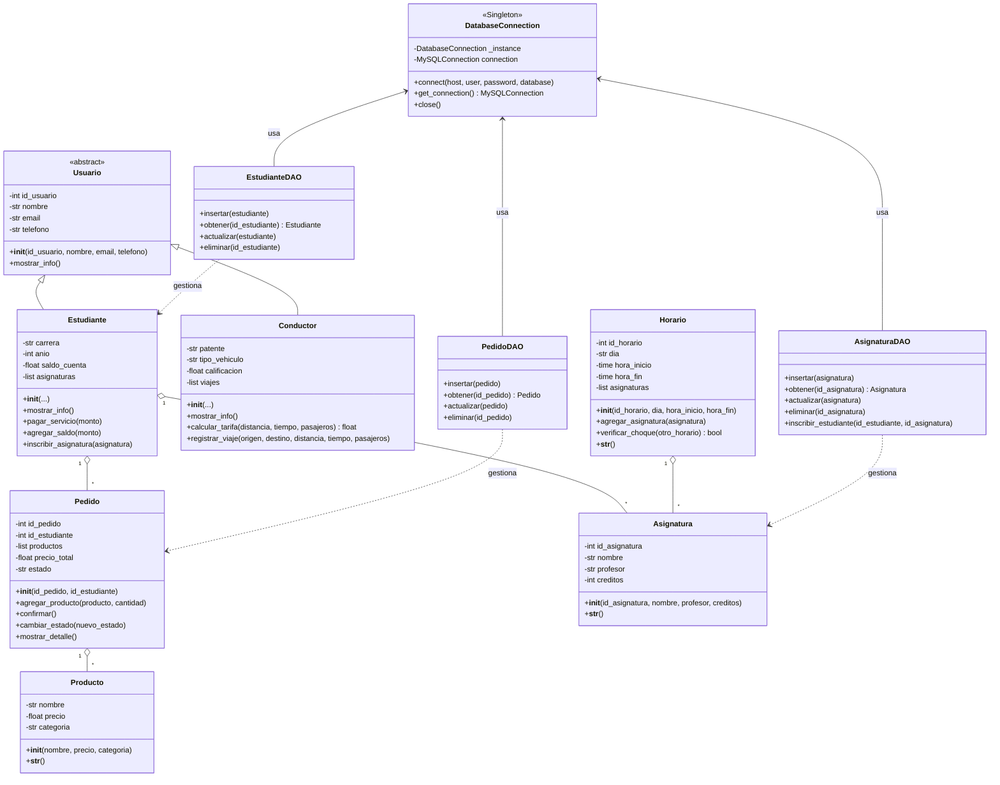

```mermaid
classDiagram
    class Usuario {
        <<abstract>>
        -int id_usuario
        -str nombre
        -str email
        -str telefono
        +__init__(id_usuario, nombre, email, telefono)
        +mostrar_info()
    }
    
    class Estudiante {
        -str carrera
        -int anio
        -float saldo_cuenta
        -list asignaturas
        +__init__(...)
        +mostrar_info()
        +pagar_servicio(monto)
        +agregar_saldo(monto)
        +inscribir_asignatura(asignatura)
    }
    
    class Conductor {
        -str patente
        -str tipo_vehiculo
        -float calificacion
        -list viajes
        +__init__(...)
        +mostrar_info()
        +calcular_tarifa(distancia, tiempo, pasajeros) float
        +registrar_viaje(origen, destino, distancia, tiempo, pasajeros)
    }
    
    class Producto {
        -str nombre
        -float precio
        -str categoria
        +__init__(nombre, precio, categoria)
        +__str__()
    }
    
    class Pedido {
        -int id_pedido
        -int id_estudiante
        -list productos
        -float precio_total
        -str estado
        +__init__(id_pedido, id_estudiante)
        +agregar_producto(producto, cantidad)
        +confirmar()
        +cambiar_estado(nuevo_estado)
        +mostrar_detalle()
    }
    
    class Asignatura {
        -int id_asignatura
        -str nombre
        -str profesor
        -int creditos
        +__init__(id_asignatura, nombre, profesor, creditos)
        +__str__()
    }
    
    class Horario {
        -int id_horario
        -str dia
        -time hora_inicio
        -time hora_fin
        -list asignaturas
        +__init__(id_horario, dia, hora_inicio, hora_fin)
        +agregar_asignatura(asignatura)
        +verificar_choque(otro_horario) bool
        +__str__()
    }
    
    class DatabaseConnection {
        <<Singleton>>
        -DatabaseConnection _instance
        -MySQLConnection connection
        +connect(host, user, password, database)
        +get_connection() MySQLConnection
        +close()
    }
    
    class EstudianteDAO {
        +insertar(estudiante)
        +obtener(id_estudiante) Estudiante
        +actualizar(estudiante)
        +eliminar(id_estudiante)
    }
    
    class PedidoDAO {
        +insertar(pedido)
        +obtener(id_pedido) Pedido
        +actualizar(pedido)
        +eliminar(id_pedido)
    }
    
    class AsignaturaDAO {
        +insertar(asignatura)
        +obtener(id_asignatura) Asignatura
        +actualizar(asignatura)
        +eliminar(id_asignatura)
        +inscribir_estudiante(id_estudiante, id_asignatura)
    }
    
    Usuario <|-- Estudiante
    Usuario <|-- Conductor
    Estudiante "1" o-- "*" Asignatura 
    Estudiante "1" o-- "*" Pedido 
    Pedido "1" o-- "*" Producto 
    Horario "1" o-- "*" Asignatura 
    
    DatabaseConnection <-- EstudianteDAO : usa
    DatabaseConnection <-- PedidoDAO : usa
    DatabaseConnection <-- AsignaturaDAO : usa
    
    EstudianteDAO ..> Estudiante : gestiona
    PedidoDAO ..> Pedido : gestiona
    AsignaturaDAO ..> Asignatura : gestiona

```
